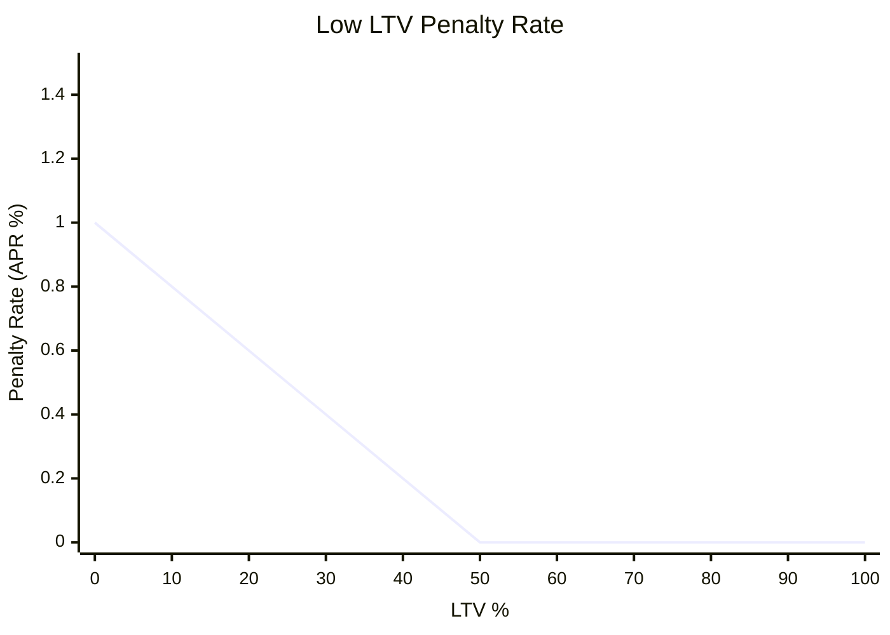

## Fees

Chainflip Lending applies a small, transparent set of fees to borrowers. These fees fund lenders, support the protocol, and maintain the economic security of the system. All fees are denominated in the borrowed assets and are processed through the Chainflip State Chain.

## Origination Fee

An origination fee is applied when opening or updating a loan position.

**Origination Fee:** 1 bps (0.01%) of the borrowed amount

**Distribution:**
- 80% → paid to lenders of that asset
- 20% → paid to the protocol (via FLIP buy-and-burn)

This fee is applied once per loan creation, and also when a loan is updated (that is, when a user borrows more on top of an existing loan, in which case the fee is only applied on the extra amount to be borrowed). Updating collateral or repaying does not incur additional fees.

## Liquidation Fee

If a loan enters soft (non-voluntary) or hard liquidation, a fee is applied to the portion of collateral that is liquidated.

**Liquidation Fee:** 5 bps (0.05%) of the liquidated collateral

**Distribution:**
- 80% → paid to lenders
- 20% → paid to the protocol (via FLIP buy-and-burn)

For more details, see
[FLIP Buy-and-Burn - Long-Term Supply Impact](https://docs.chainflip.io/protocol/token-economics/current-token-economics-2025-and-beyond#flip-buy-and-burn-long-term-supply-impact).

This fee is separate from any discount or incentive used to attract LPs to fill liquidation orders.

## Interest Rate Mechanics

Interest accrues continuously (**every 10 blocks**) on outstanding debt. Borrowers see their outstanding debt increase based on the **borrow rate**, which follows the utilisation-based interest model described above.

Interest is always accrued and paid in the **borrowed asset**.

### **Interest Flow**

Borrowers pay interest in the borrowed asset. The supply rate goes to lenders, and a flat **+1% APR network fee** is added on top and collected by the protocol (then swapped into FLIP via the buy-and-burn system).

### **Example**

If the supply APY is **8%**, then borrowers pay:

- **8% APY** → paid to suppliers
- **+1% APY network fee** → paid to the protocol and swapped into FLIP
- **= 9% total borrow APY**

## Low LTV Penalty

Borrowers who maintain overly low LTVs (i.e., extremely overcollateralised positions) incur a small penalty designed to discourage inefficient use of system economic security.

Applies only when **LTV < 50%**.

**Penalty scales linearly:**
- 1% APY at 0% LTV
- 0% APY at 50% LTV

This penalty is added to the borrower’s effective interest rate and flows entirely to the protocol.

## Fee Processing and Settlement

All fees (origination, liquidation, interest, penalties, network fees) follow this flow:

- Denominated in the borrowed asset
- Debited from borrower positions automatically
- Distributed to lenders and the protocol in the correct proportions
- Protocol fees aggregated and swapped into FLIP via buy-and-burn

This system keeps accounting simple and ensures suppliers always earn yield in the asset they supplied.