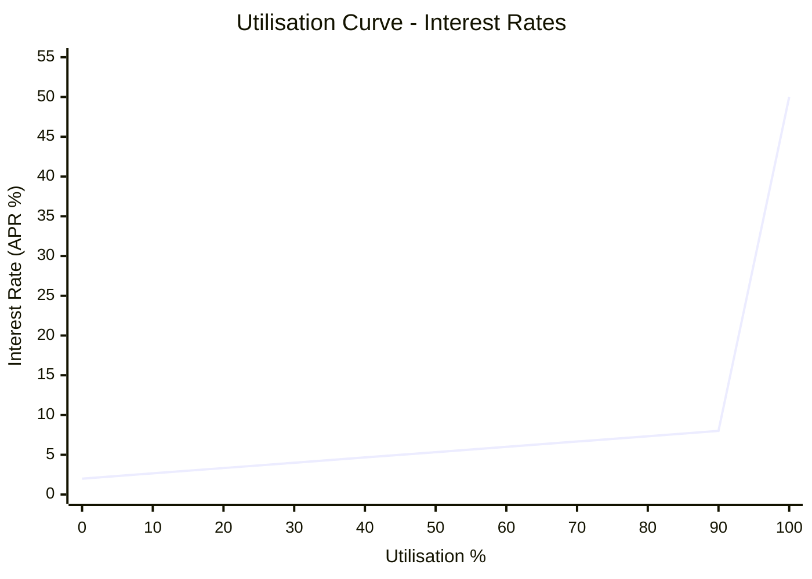

import { Callout } from "nextra/components";

## Utilisation & Interest Rates

### What Is Utilisation?

Chainflip Lending uses a utilisation curve model to determine real-time borrowing and lending rates. Utilisation represents how much of a pool’s liquidity is currently borrowed:

$$
\text{Utilisation} = \frac{\text{Borrowed Amount}}{\text{Total Supplied}}
$$

As utilisation rises, available liquidity decreases, which increases borrowing rates and boosts yield for suppliers.

A utilisation curve keeps the lending market balanced by automatically:
- increasing borrowing costs when liquidity becomes scarce
- rewarding suppliers when demand rises
- encouraging repayment at high utilisation
- attracting additional lenders to supply more liquidity

This dynamic ensures the pool remains healthy without manual intervention.

---

### How the Utilisation Curve Works

The Chainflip utilisation curve has two segments:

#### Low to Optimal Utilisation
Interest rates rise gradually as utilisation increases. Borrowing remains inexpensive, and lender yields stay moderate. This encourages loan creation and normal market activity.

#### Above Optimal Utilisation
Once utilisation passes the optimal point, the curve becomes steep. Borrowing costs rise sharply to prevent liquidity exhaustion and to attract more supply.

Higher yields naturally attract additional liquidity into the pool, increasing the amount available for borrowing. This provides a secondary mechanism, beyond borrower repayments, that helps bring utilisation and rates back down to normal levels.

This behaviour gives borrowers confidence that rates can normalise through increased supply, not solely through their own repayments.

|Utilisation|Interest Rate|
|-----------|-------------|
|0%         |2%           |
|90%        |8%           |
|100%       |50%          |

<Callout type="info">
Actual rates may be different to those shown above.
</Callout>

---

### Interest Accrual

Interest is always accrued in the borrowed asset.

Examples:
- Borrowing USDC → interest accrues in USDC
- Borrowing USDT → interest accrues in USDT

Lenders always receive yield in the same asset they supplied, regardless of what other users borrow.
Interest is calculated every 10 blocks and distributed proportionally to all suppliers, however it needs to exceed a certain threshold (0.1 USD) before it is collected and distributed in the pool.

---

### Network Fee Rate

A flat additional 1% APR network fee is added on top of the supply rate to derive the final borrow rate.

Example at 90% utilisation:
- Supply rate = 8% APR
- Borrow rate = 9% APR
(The extra 1% goes to the protocol)

Network fees are periodically swapped into FLIP via the buy-and-burn mechanism.

---

### Supply as Collateral: The Unified Pool Model

Chainflip Lending uses a **unified pool model**: all supplied assets become collateral, similar to the default settings of established DeFi lending protocols.

Supplied collateral can be used in loans, which:
- offsets the cost of borrowing
- lets passive suppliers and borrowers earn interest on otherwise idle capital
- improves overall market efficiency and rates

For **BTC specifically**, supply in the unified pool is also partially utilised to power [Boosted](/protocol/boost) swaps and deposits. This means BTC suppliers and borrowers earn additional Boost yield on top of lending interest, even at low utilisation.

---

### Utilisation Caps Protect Liquidation Capacity

Supply as collateral might initially sound like it adds risk to the lending protocol, but that risk is managed. Lending enforces a **utilisation cap** on every asset: a new loan is rejected if it would reduce loan coverage below **100%**.

This ensures there is always enough of each collateral asset available (i.e. not locked in outstanding loans) to fully liquidate all loans at current Oracle prices.

Actual utilisation can still temporarily exceed the cap due to price movement or supplier withdrawals, but no new borrowing is allowed until the pool recovers. The cap exists specifically to stop a large Boost deposit, or any other borrower activity, from leaving an asset unavailable for liquidations.

100% loan coverage is a very conservative default, as there are almost no scenarios in which 100% of loans need to be liquidated at the same time. Partial liquidations can restore loans to healthy LTV levels without requiring full liquidations.

---

### Why Utilisation Matters for Borrowers and Lenders

#### For Borrowers
- Low utilisation → cheaper borrowing
- High utilisation → more expensive borrowing
- Very high utilisation → strong incentive to repay or add collateral
- Additional supply entering the pool helps bring rates down

#### For Suppliers
- Low utilisation → lower yields
- High utilisation → higher yields
- Very high utilisation → strong returns but indicates heavy borrowing demand
- New lenders are incentivised to join when yields spike
